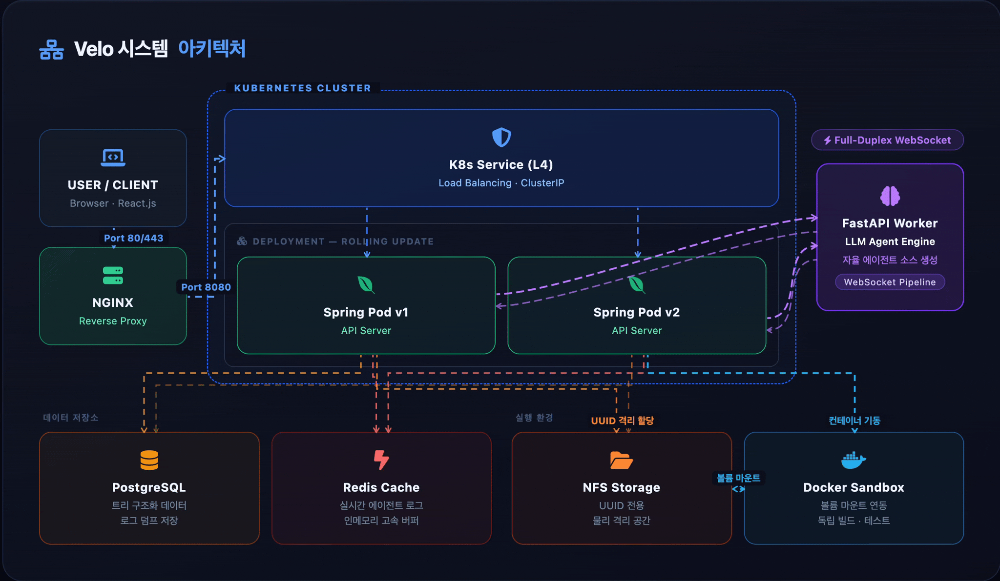

---
# 시스템 아키텍처


# Velo (aeranghae)

**"자연어 입력만으로 완성되는 자율화된 프로젝트 생성 플랫폼"**

Velo는 사용자의 아이디어를 자연어로 입력받아, AI 에이전트가 직접 코드를 설계, 작성, 빌드 및 테스트까지 수행하는 **AI 기반 자동화 프로젝트 생성 엔진**입니다.

## 핵심 기능

* **자율 코드 생성:** Spring Boot 오케스트레이터가 FastAPI/LLM 에이전트와 연동하여 실제 프로젝트 구조와 소스 코드를 자동으로 생성합니다.
* **격리된 샌드박스 환경:** Docker 컨테이너를 동적으로 제어하여 빌드 및 실행을 보장하며, 자원 제한(CPU/Memory)을 통해 안정성을 확보합니다.
* **실시간 파이프라인 모니터링:** SSE(Server-Sent Events)를 통해 프로젝트 생성 과정의 로그와 빌드 상태를 실시간 추적합니다.
* **파일 시스템 가상화:** 생성된 프로젝트의 파일 트리를 탐색하고 실시간으로 내용을 조회할 수 있습니다.
* **기술 스택 자동화:** React, Vue, Next.js, Spring Boot, NestJS 등 다양한 템플릿을 자동으로 초기화합니다.

## Tech Stack

* **Backend:** Java 21, Spring Boot 4.0, Spring Security, JWT, OAuth2
* **Database & Cache:** PostgreSQL (JSONB), Redis
* **Infra:** k8s, Docker (Docker-java), NFS (네트워크 파일 시스템)
* **AI/Integration:** FastAPI Agent, WebSocket (Full-duplex 실시간 통신)

---

## 환경 설정 (Configuration)

### 1. `application.yml` 설정 예시

시스템 배포 시 아래 예시를 참고하여 환경에 맞게 수정하세요. 실제 운영 시 `client-secret` 등 민감 정보는 환경 변수로 주입하는 것을 강력히 권장합니다.

```yaml
# 일반데이터베이스와 레디스도 연결해야합니다.
 
# JWT 설정 (추가된 부분)
jwt:
  # 환경 변수가 없으면 기본값(스크립트 내용)을 사용합니다.
  secret: ${JWT_SECRET:qwertytmskdlstkfkdgodyauddlsclfrn1234567890!@#}
  # 만료 시간: 3600000ms = 1시간
  expiration: 3600000

# 서버 포트 설정
server:
  port: 8080
  tomcat:
    max-http-form-post-size: 50MB

# CORS 및 앱 보안 설정
app:
  cors:
    allowed-origins: ${CORS_ORIGINS:http://localhost:5173}
  encryption:
    key: "this-is-32-character-secret-key@"

# 유저별 개인저장소 및 기타 설정
velo:
  storage:
    # 환경 변수 STORAGE_PATH가 있으면 사용하고, 없으면 기존처럼 로컬 상대경로를 씁니다.
    path: ${STORAGE_PATH:/app/storage/userdir}
    realpath: "/nfs/velo/storage/userdir"
  project:
    maxcount: 6
  ignore: # 프로젝트 생성 시 색인에 추가하지 않을 파일들
    directories:
      - ".git"
  docker:
    # 매핑되지 않는 미지의 프레임워크 대비용 가드 이미지
    default-image: "ubuntu:22.04"

    # 프레임워크 키워드별 매핑 이미지 (framework: "이미지") 형식으로 추가 가능합니다.
    # 언어 키워드별 매핑 이미지 (language: "이미지") 형식으로 추가 가능합니다.
    # 단 두 경우 모두 "이미지"는 사전에 서버에 pull된 상태여야함
    framework-images:
      fastapi: "python:3.12-bookworm"

    language-images:
      python: "python:3.12-bookworm"

# LLM 서버 설정
llm:
  server:
    allowed-ips: 127.0.0.1  # 허용할 LLM서버의 아이피
    allowed-paths: /api/internal/llm # 허가할 엔드포인트 리스트 (리스트 형태로 추가 가능)
    url: http://192.168.0.xxx:8000 # 스프링 LLM서버 간 통신할 IP주소
    ws: ws://192.168.0.xxx:8000 # 스프링 LLM서버 간 웹소켓 통신할 IP주소

```

### 2. 주요 환경 변수 가이드

| 환경 변수명 | 설명 | 비고 |
| --- | --- | --- |
| `JWT_SECRET` | JWT 토큰 서명용 비밀키 | 32자 이상 권장 |
| `GOOGLE_CLIENT_SECRET` | 구글 OAuth 클라이언트 시크릿 | 보안 필수 |
| `CORS_ORIGINS` | 허용할 클라이언트 도메인 | 기본: `http://localhost:5173` |

---

## 시스템 의존성 및 인프라

* **Database:** `xxx.xxx.xxx:xxxx`에 접근 가능해야 합니다.
* **Redis:** 실시간 로그 버퍼링을 위해 가동되어야 합니다.
* **LLM & Agent Server:** FastAPI 에이전트(`192.168.0.xx:8000`)가 네트워크상에서 대기 중이어야 코드 생성 공정이 시작됩니다.
* **Docker Socket:** 호스트의 `/var/run/docker.sock`을 마운트하여 컨테이너 제어 권한을 부여해야 합니다. (root 권한)

## 도커 환경 매핑

프레임워크별로 최적화된 도커 이미지를 자동으로 선택합니다.

* **Python(FastAPI):** `python:3.12-bookworm`
* **Node.js(React/Vue/Next/Nest):** `node:22-bookworm`
* **Java(Spring Boot):** `eclipse-temurin:21-jdk-jammy`
* **기타:** `ubuntu:22.04` 기본 이미지 사용

## 시작하기 (Getting Started)

### Prerequisites

* JDK 21+ / Docker
* PostgreSQL / Redis / NFS 운영 환경

### Installation & Run

1. **Repository Clone:** `git clone [https://github.com/oxxultus/aeranghae.git](https://github.com/oxxultus/aeranghae.git)`
2. **Build:** `./gradlew build`
3. **Execution:** 설정된 인프라(DB, Redis, LLM 서버)가 준비된 상태에서 애플리케이션을 실행합니다.

## License

이 프로젝트는 선택된 라이선스 정책(MIT, Apache 2.0 등)을 따릅니다. 자세한 내용은 `LICENSE` 파일을 확인해 주세요.

---

- 더 나은 개발 경험을 위한 자동화 여정에 함께해 주셔서 감사합니다!
